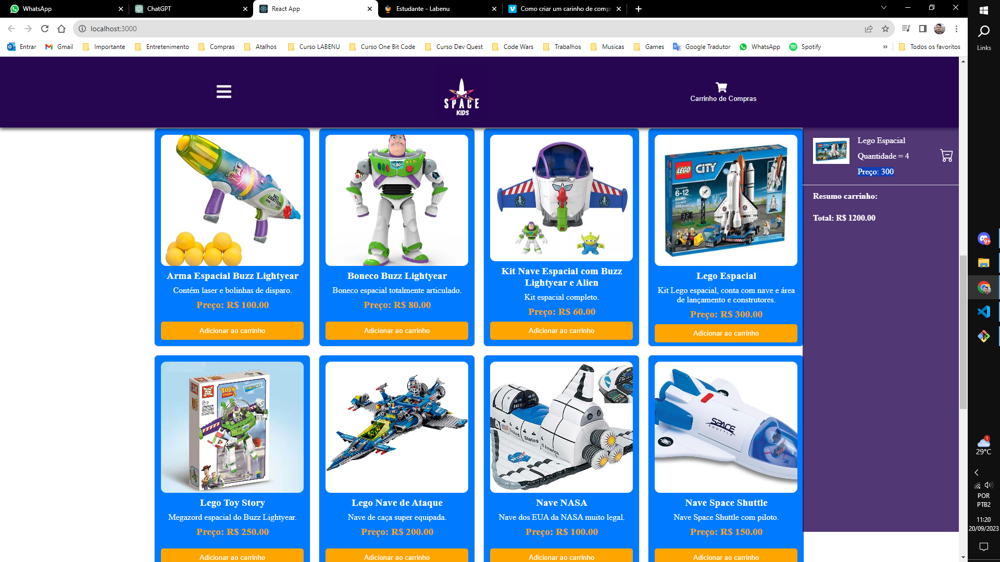
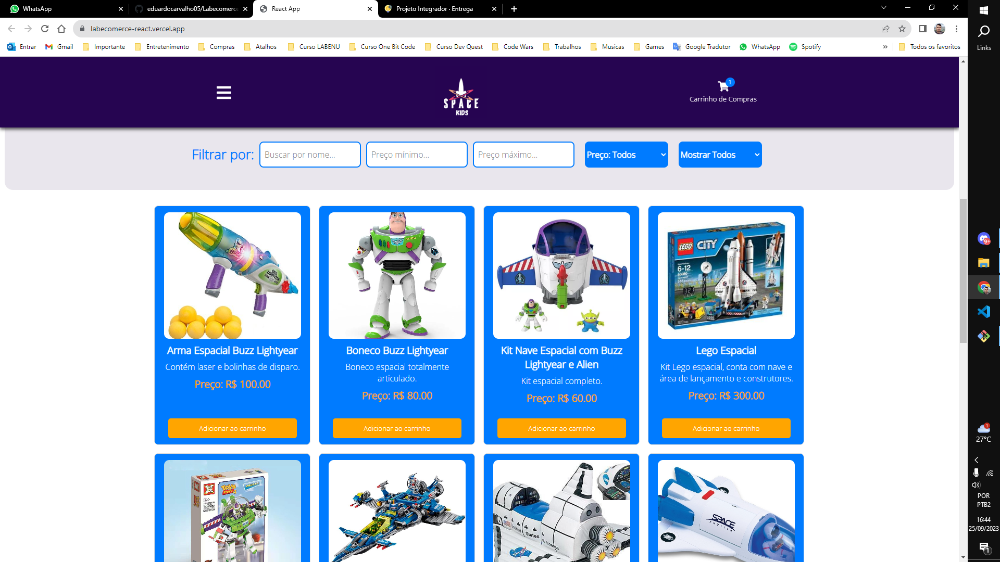
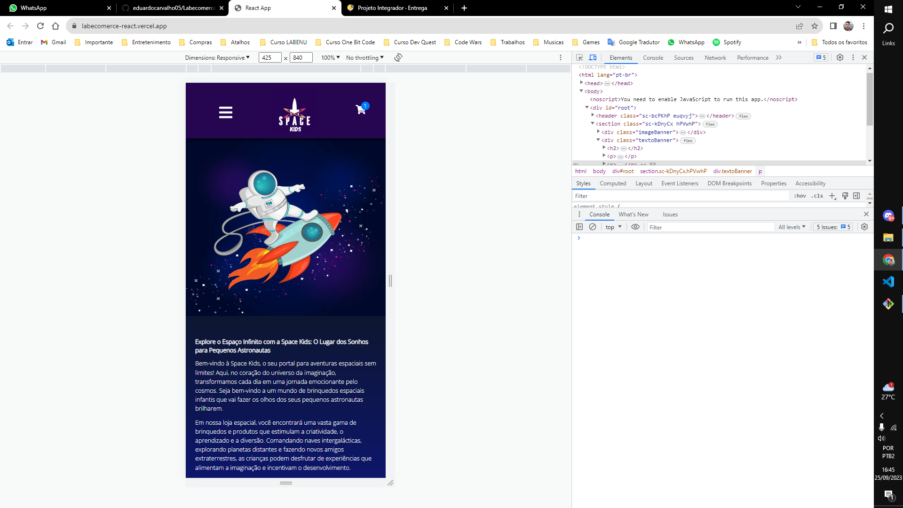
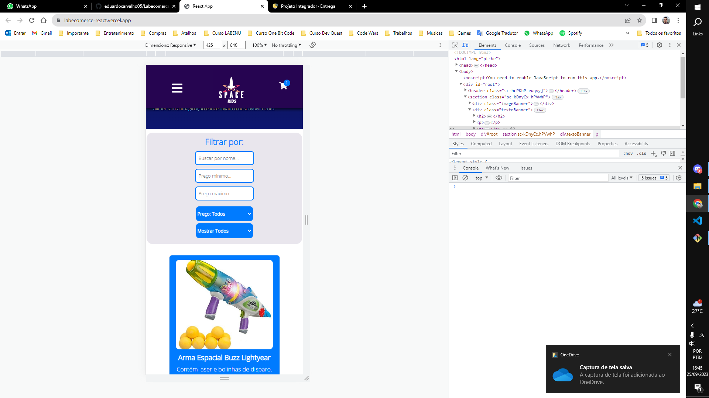
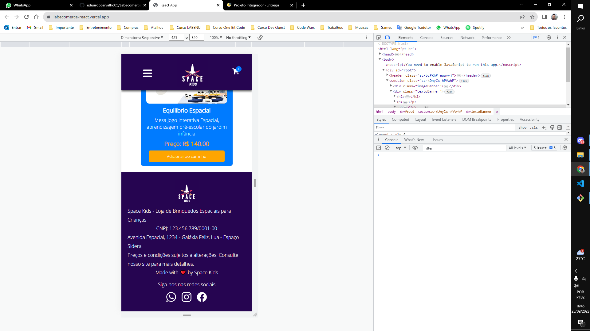

Link do projeto no vercel : https://labecomerce-react.vercel.app/

projeto-frontendreact

Esse é o projeto de introdução aos fundamentos do React. Aqui, vamos praticar a estrutura do que consideramos a estrutura do React. O objetivo é que funcione como o front-end de um E-Commerce

JSX
Componentes
Props
Estado
Fluxo de dados no React
Renderização de listas
Renderização condicional
localStorage

////////////////////////////////////////////

Home
Mostrando todos os produtos
Deve haver alguma forma de ordenar os produtos por ordem crescente ou decrescente de preço (pode ser na home em si ou junto dos filtros)
Produtos:
Devem ter um botão que permita adicioná-los ao carrinho
Devem exibir o nome, preço e imagem em um card

Carrinho
Mostrar todos os produtos e quantidades adicionadas
Capacidade de remover itens do carrinho
Mostrar o valor total do carrinho

Filtro
Por valor mínimo e máximo
Por nome do produto

/////////////////////////////////////////////

Segue alguns prints do projeto

Versão desktop:

  
 
  

Versão mobile:

 
 
